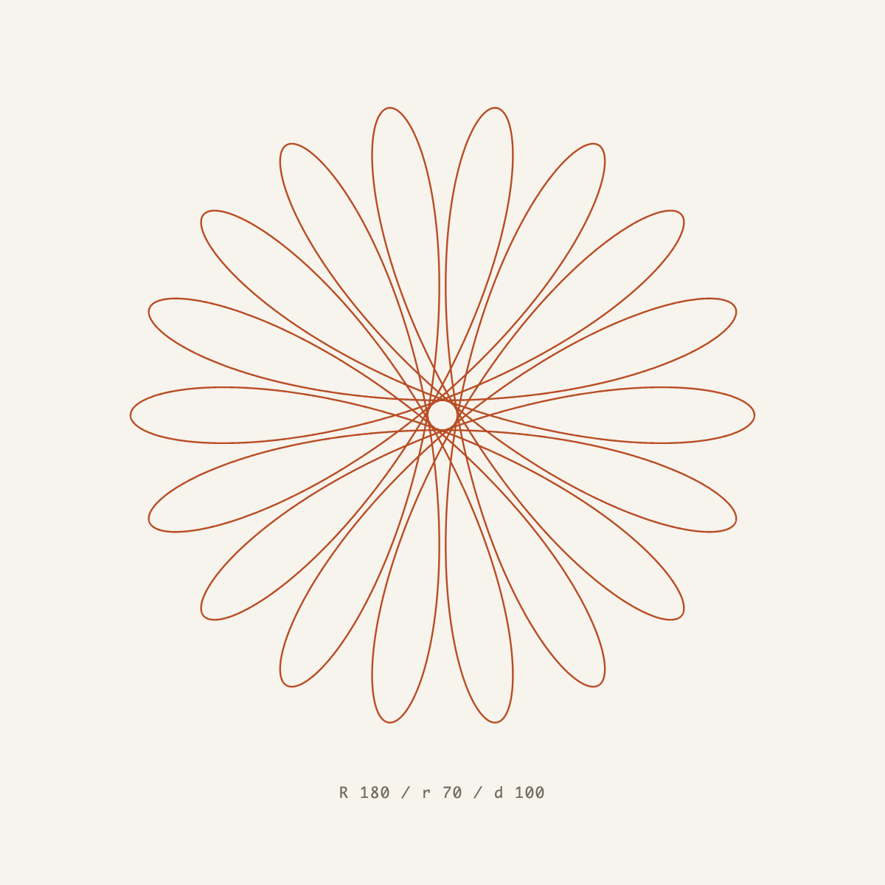

# Spirograph

固定円の内側を転がる円にペンを取り付け、その軌跡（ハイポトロコイド）をp5.jsで描くレポジトリである。3つの数値を動かすと、図形が即座に描き変わる。

**デモ: https://kagari-tech.github.io/p5-spirograph/**

## 使い方

- 固定円の半径 `R`、回転円の半径 `r`、ペンの距離 `d` を数値入力またはスライダーで変更すると、図形が即座に変化する。
- 数値は整数で指定する。`R` は2〜300、`r` は1〜R−1、`d` は0〜300。`R` を小さくして `r` が収まらなくなった場合、`r` も自動で小さくなる。
- 「初期値に戻す」で最初の図形に戻る。図形は常に表示領域に収まる大きさで描画する。

## ローカルで動かす

`index.html` をブラウザで開くだけでよい。サーバーの起動やパッケージのインストールは不要。p5.jsは[公式ページ](https://p5js.org/download/)に記載のjsDelivr CDN（バージョン2.3.3）から読み込むため、インターネット接続が必要。

## ファイル構成

| ファイル | 役割 |
| --- | --- |
| `index.html` | 画面の構造と、入力欄の制約（`min` / `max` / `step`） |
| `index.css` | 配色とレイアウト |
| `spirograph.js` | 曲線の計算、描画、入力値の検証 |
| `ogp.png` | SNS共有時に表示されるカード画像（1200×630） |
| `sample.png` | 記事などに貼るための作例画像（1200×1200） |

## 生成について

このレポジトリのコードとドキュメントは、OpenAI Codexによって生成したものである。内容は動作確認のうえで公開しているが、学習用のサンプルとして参照されたい。

## ライセンス

MIT License（[LICENSE](LICENSE)）。p5.js本体は同梱しておらずCDNから読み込むため、p5.js自体のライセンスは[公式リポジトリ](https://github.com/processing/p5.js)を参照。
